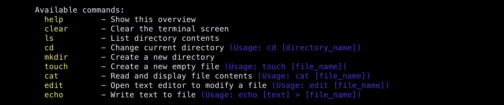
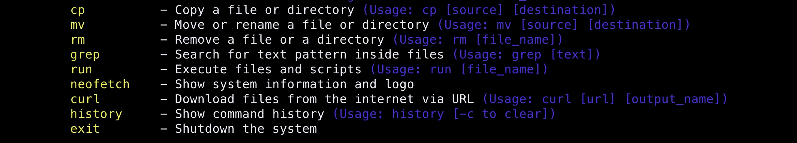
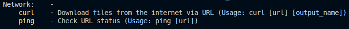

## Python Shell by HayaraLV

A custom shell written in Python.

## Features

* File system navigation (cd, ls)
* File management (cat, touch, mkdir, cp, mv, rm)
* Text utilities (edit, echo, grep)
* Command execution system (run)
* Command history (history)
* Built-in system information (neofetch)
* Basic network requests (curl)
* Custom command parser
* Cross-platform Python implementation

## Available Commands

## Version

Current version: 2.0.0.0

## About

This project was created as a personal experiment to learn Python, command parsing, file operations, and terminal development. It is still in development and may include bugs or unfinished features.
