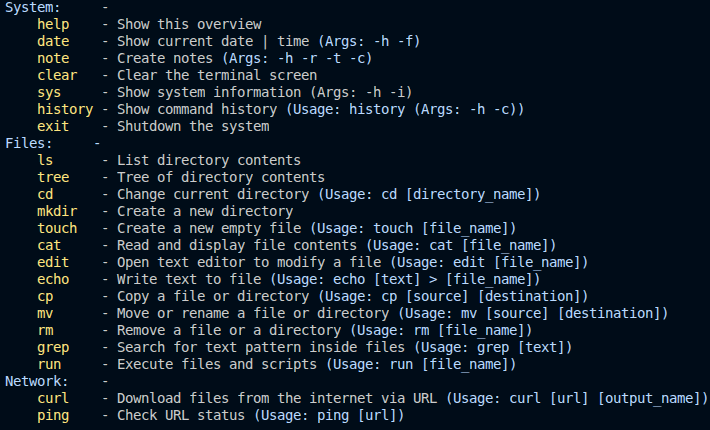

## Python Shell by HayaraLV


A custom, lightweight shell written in Python. It replicates core Unix terminal functionality with built-in navigation, file management, basic networking, and system utilities.

## Features

### File System & Navigation
* **cd** — Change the current working directory.
* **ls** — List directory contents.
* **tree** — Display directory structure in a visual tree format.
* **mkdir** — Create a new directory.

### File & Text Management
* **touch** — Create a new empty file.
* **cat** — Read and display file contents.
* **edit** — In-terminal text editor utility to modify files.
* **echo** — Write text or redirect output to a file.
* **note** — Quick note-taking tool with creation, retrieval, and tags.
* **cp** — Copy a file or directory.
* **mv** — Move or rename a file or directory.
* **rm** — Remove a file or a directory.
* **grep** — Search for a specific text pattern inside files.

### Networking & Execution
* **wifi** — Manage Wi-Fi connections (list, connect, disconnect).
* **curl** — Download files from the internet via URL.
* **ping** — Check network host connectivity and URL status.
* **run** — Execute external files, scripts, and system commands.

### System & Environment
* **sys** — Display technical system information.
* **neofetch** — Visual, detailed system information layout.
* **date** — Show current date and time.
* **clear** — Clear the terminal screen.

### Terminal Control
* **help** — Show the overview of available commands and usage instructions.
* **history** — View and clear the command execution history.
* **exit** — Shutdown the system or safely close the terminal session.

### Core Architecture
* **Custom Command Parser** — Custom-built logic for robust command and argument handling.
* **Cross-Platform Implementation** — Fully written in Python to ensure seamless compatibility across Windows, macOS, and Linux.

## Available Commands



## How to Run

This program can be executed on Linux, Windows, and macOS. Depending on your operating system, use the appropriate commands below.

### Linux
The script requires superuser privileges (`sudo`) to function correctly on Linux:
```bash
sudo /usr/bin/python3 /PythonShell/PS/PyShell.py
```
Alternatively, navigate to the project directory and run:
```bash
cd PythonShell/PS/
sudo python3 PyShell.py
```

### Windows
On Windows, use the standard `python` interpreter (or `py` launcher) and backslashes `\` for paths.

**Standard execution:**
```cmd
python "C:\PythonShell\PS\PyShell.py"
```

**With Administrator privileges:**
1. Open **Command Prompt** or **PowerShell** as Administrator.
2. Execute the following commands:
```cmd
cd "C:\PythonShell\PS"
python PyShell.py
```

### macOS
macOS uses a Unix path structure where the user's home directory is located under `/Users/`.

```bash
sudo python3 /PythonShell/PS/PyShell.py
```
Alternatively, navigate to the project directory and run:
```bash
cd /PythonShell/PS
sudo python3 PyShell.py
```

